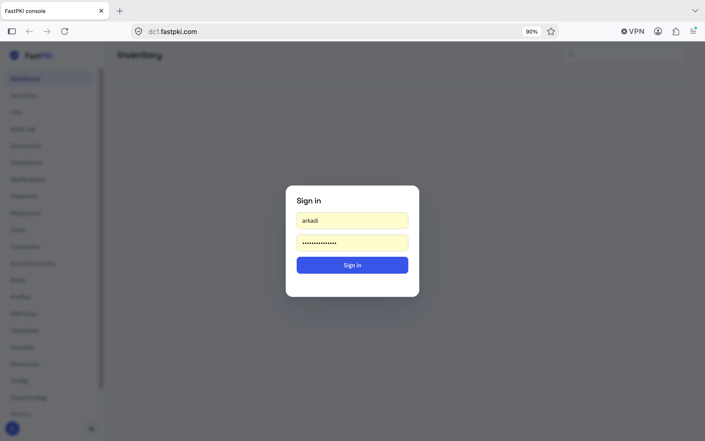
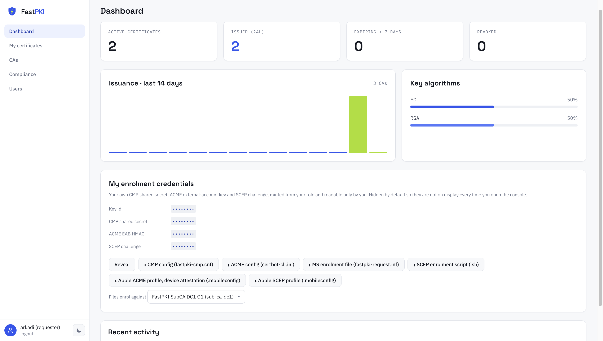
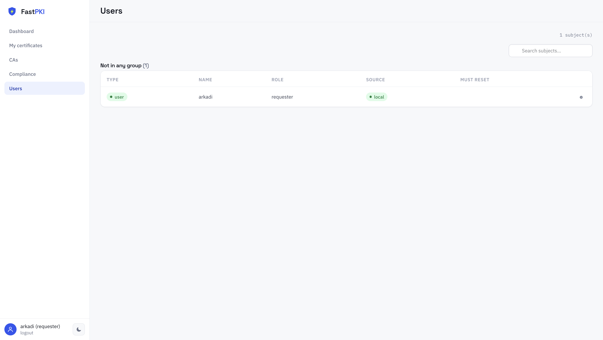
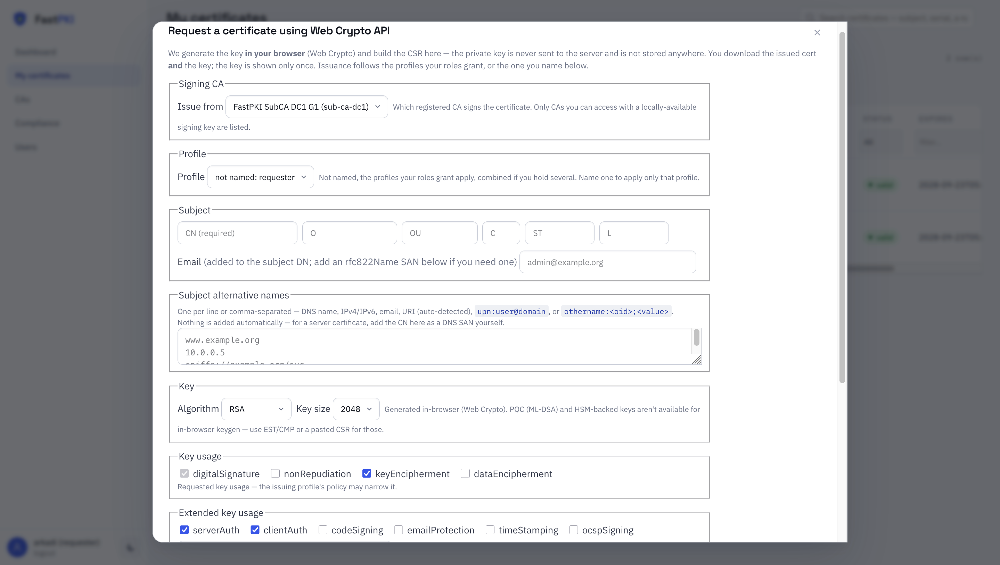
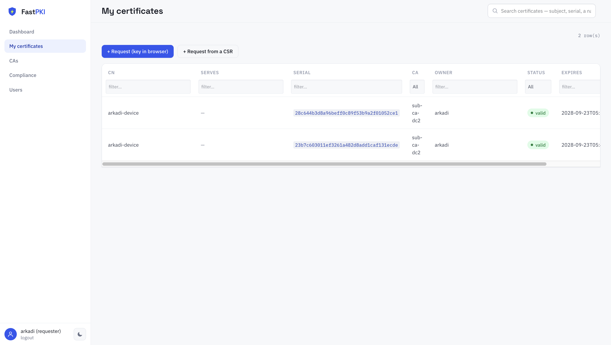
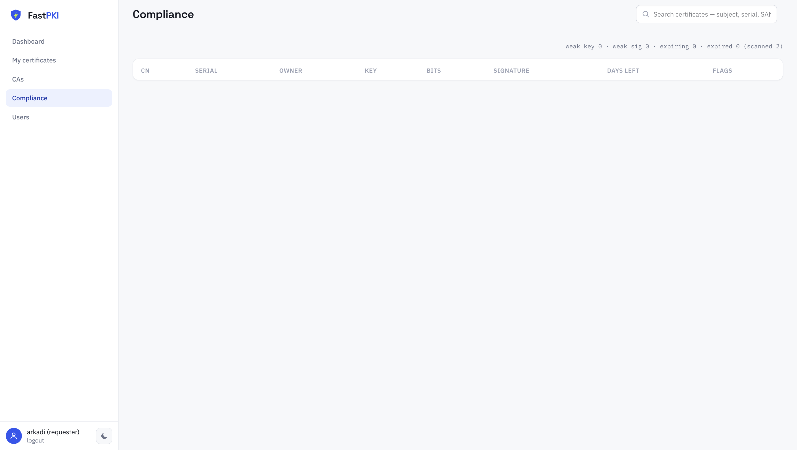
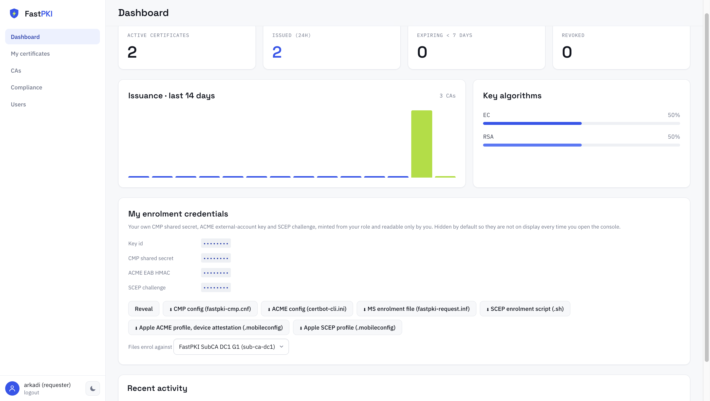
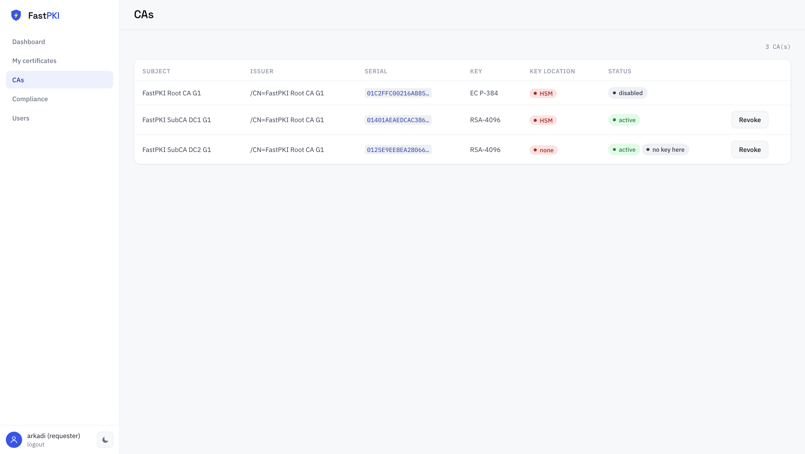

# FastPKI — User Guide

For someone who needs a certificate. If you run the deployment, you want
[`admin-guide.md`](admin-guide.md) instead.

You will be given a console URL (something like `https://pki.example.org:8090`) and a
login. Everything below is either in that console or driven by an enrolment client using
credentials you download from it.

**Two ways to get a certificate, and the choice is about renewal, not about difficulty:**

- **The console** (§2) issues you one certificate, now. Nothing renews it. Right for a
  one-off, and for anything where a human decides.
- **An enrolment protocol** (§5 onward) lets a client get its own certificate and *keep*
  getting them. Right for anything that must still be working in a year without you
  remembering it.

## Contents

1. [Logging in](#1-logging-in)
2. [Getting a certificate from the console](#2-getting-a-certificate-from-the-console)
3. [What you may be refused, and why](#3-what-you-may-be-refused-and-why)
4. [Your certificates](#4-your-certificates)
5. [Automated enrolment — choosing a protocol](#5-automated-enrolment--choosing-a-protocol)
6. [ACME (RFC 8555)](#6-acme-rfc-8555)
7. [EST (RFC 7030)](#7-est-rfc-7030)
8. [SCEP (RFC 8894)](#8-scep-rfc-8894)
9. [CMP (RFC 4210 / 9810)](#9-cmp-rfc-4210--9810)
10. [MS-XCEP / MS-WSTEP — Windows autoenrolment](#10-ms-xcep--ms-wstep--windows-autoenrolment)
11. [Looking a certificate up (RFC 4387)](#11-looking-a-certificate-up-rfc-4387)
12. [Checking whether a certificate is still valid](#12-checking-whether-a-certificate-is-still-valid)
13. [Trusting the CA](#13-trusting-the-ca)
14. [Renewal](#14-renewal)
15. [When something does not work](#15-when-something-does-not-work)

---

## 1. Logging in

Open the console URL. **It is HTTPS** — the console needs a secure context because it
generates keys in your browser, and browsers only allow that over HTTPS. If the
certificate warning names your own PKI, that is a deployment still using its first
self-signed certificate; ask your administrator rather than clicking through on a page
where you are about to type a password.



After signing in, the pages on the left depend on your role. An ordinary requester sees
**Dashboard**, **My certificates** (the Inventory), **CAs**, **Compliance** and **Users**
(their own account only).



If you see **only an empty Dashboard** and no other pages, your account exists but holds no
role yet. Ask an administrator to grant you a role.

After too many wrong passwords the sign-in page says *too many failed sign-in attempts — try
again in 30s*, with the actual number of seconds. Wait that long. Each further failure makes
the wait longer, up to a limit.

### Changing your password

**Change the password you were given.** Open the **Users** page and press ⚙ on your own row.
Type your **Current password** and a **New password** of at least 8 characters, then press
**Save**. Your other signed-in sessions end; the one you are using stays.



If your account was created with a forced reset, the console shows a **Set a new password**
screen straight after sign-in. It asks for the same two things, and nothing else works until
you have done it.

This applies to local accounts only. A directory or single-sign-on account's password belongs
to that directory; change it there.

### Your email address

FastPKI can email you before your certificates expire (§14). To say where, open the **Users**
page, press ⚙ on your own row, type your **Email** and press **Save**. No password is needed for
this, so leave both password fields empty.

If you sign in through a directory, the address the directory holds for you is used when it has
one. If you sign in through single sign-on, the field is filled in from your identity provider
each time you sign in.

### Your username may be qualified

If the deployment authenticates against a directory, your username carries the provider it
came from: `CORP\alice` is Alice in the directory named CORP, and a bare `alice` is a
**local** account in FastPKI's own user table. These are different accounts and always will be —
FastPKI never guesses which directory you meant.

If the sign-in page shows a domain list, pick your directory there and type your plain name.
Its first entry, **local account**, means FastPKI's own user table. You can also type the
qualified name yourself, as `CORP\alice` or `alice@corp.example`.

---

## 2. Getting a certificate from the console

Open **Inventory** (called **My certificates** for the requester role). The request buttons
sit above the list, and which one you want depends on **where the private key should
live**. That is the only real difference between them.

- **+ Request (key in browser)** (§2.1) and **+ Request from a CSR** (§2.3) are there for
  anyone allowed to request certificates.
- **+ Request (key in HSM)** (§2.2) appears only if your role may create keys in the
  deployment's token. Most users do not see it.
- If the page shows **read-only** and no request buttons, your administrator has switched
  console writes off.


Every form has an **Issue from** list: the CA that signs your certificate. It shows each CA
as its name followed by its id in brackets. If it reads *no CA on this node can issue
certificates*, there is nothing to sign with; ask an administrator.

The profiles your roles grant decide which names, key usages and purposes you may have; if you
hold several, you may have anything any of them allows. The key-in-browser and CSR forms have a
**Profile** list: leave it *not named* for that, or pick one of your profiles to apply only
that one. The key-in-HSM form shows which profile will apply and does not let you choose.

⚠️ **The certificate may carry your username instead of the name you typed.** By default a
self-service certificate is bound to the person who asked for it: its CN is replaced by your
username, and your groups are added as OUs. Your profile decides whether this happens. The
additional names (SANs) you enter are kept, within what your profile allows.

### 2.1 "Request (key in browser)" — the usual one

Your browser generates the key on your computer and sends the server only a certificate
request. When the certificate comes back, the browser saves it and the key as files on your
computer. **The key never reaches the server**, which is what you want for a certificate that
lives on your own machine.



1. Choose the CA in **Issue from**.
2. Fill in the name (**CN**). O, OU, C, ST, L and Email are optional.
3. Add the additional names (**SANs**), one per line. **Nothing is added for you**: for a
   server certificate, put its DNS name here, even if it is already the CN. macOS ignores the CN
   and rejects a server certificate without a SAN.
4. Pick the key: RSA, RSA-PSS, EC or Ed25519, with a size or curve. For a certificate that
   Macs or iPhones must accept, use RSA or EC: macOS and iOS reject RSA-PSS and Ed25519
   ([compatibility.md](compatibility.md) §4).
5. Leave the key usage and extended key usage boxes as they are unless you need something
   else. Your profile may narrow them.
6. Under **Output**, optionally type a password, and pick a format:

| Format | You get | Use it for |
|---|---|---|
| **PEM** | `<name>.pem` and `<name>.key.pem` | Linux/Unix services, nginx, Apache, most tooling |
| **DER** | `<name>.crt` and `<name>.key.der` | Windows tooling and some appliances that will not read PEM |
| **PKCS#12 (.p12)** | one `<name>.p12` | Windows, Java keystores, macOS Keychain — one password-protected file holding the certificate and the key together |

7. Press **Generate & request**. The browser saves the files to your usual downloads folder.

The password encrypts the private key. It is optional for PEM and DER, and required for
PKCS#12, where it is the only thing protecting your private key in that file.
**The saved key file is your only copy.** The server never had the key, so it cannot give it
to you again; if you lose it, you request a new certificate.

**Revoke the old one when you do** (§4). Without its key that certificate can do nothing for
you, but it stays valid until it expires: clients still accept it, and it goes on counting
against the number of certificates your role allows (§3), which is what stops you requesting
the replacement. Choose **cessationOfOperation** for a key that is simply gone, and
**keyCompromise** if it might be in someone else's hands — a lost laptop, a stolen backup, a
shared machine.

### 2.2 "Request (key in HSM)" — for a key that must not be copyable

The key is generated **inside the deployment's hardware token** and never exists outside
it. You get the certificate; there is no key to download. The form shows which
profile the server will apply.

Use this for a service identity, an RA credential, or anything where "nobody can copy this
key, including me" is the requirement. Use §2.1 for a certificate on a laptop. The form's
fields are described in [`admin-guide.md`](admin-guide.md) §4.3.

A certificate issued this way is also the one kind you can **renew** later from its details,
because the deployment still holds its key (§4).

### 2.3 "Request from a CSR" — when you already made the key

Use this when a device or an appliance produced the request, or when your key is already
somewhere you cannot move it from. Make a PKCS#10 certificate request yourself, e.g.

```bash
openssl req -new -newkey rsa:3072 -nodes -keyout my.key -out my.csr -subj "/CN=host.example.org"
```

1. Choose the signing CA in **Issue from**.
2. Paste the whole PEM request, including the `-----BEGIN CERTIFICATE REQUEST-----` line.
3. Press **Request**. The certificate downloads as a `.pem` file.

The names come from the CSR, subject to the username rule above.

#### On Windows, without OpenSSL

`certreq` makes the request and leaves the private key in Windows' own store, which is what
you want for IIS, RDP or a service running as the machine.

```powershell
# MachineKeySet puts the key in the COMPUTER's store — run PowerShell as administrator for
# that. Drop the line to request as yourself, in your own store.
@'
[NewRequest]
Subject = "CN=host.example.org"
KeyLength = 3072
KeyAlgorithm = RSA
MachineKeySet = true
Exportable = false
[Extensions]
2.5.29.17 = "{text}"
_continue_ = "dns=host.example.org"
'@ | Set-Content request.inf

certreq -new request.inf request.req
```

Paste `request.req` into the form. It starts `-----BEGIN NEW CERTIFICATE REQUEST-----`, which is
Windows' spelling of the same thing and is accepted as it stands.

Save the certificate that comes back as `host.cer` — the text is the same, only the name
differs — and give it to the waiting request:

```powershell
certreq -accept host.cer            # add -machine if the request used MachineKeySet
```

That is the step that pairs the certificate with the key Windows kept; a certificate merely
copied into the store has no key behind it. It needs this PKI's root certificate in **Trusted
Root Certification Authorities** first — the machine's store for a machine request, your own
otherwise (§13) — or it fails with `CERT_E_UNTRUSTEDROOT`.

**With the GUI instead:** open `certmgr.msc` for your own certificates or `certlm.msc` for the
computer's. Right-click **Personal** → **All Tasks** → **Advanced Operations** → **Create Custom
Request**, choose **Proceed without enrollment policy**, and take **(No template) CNG key**. On
the request page open **Details** → **Properties** to type the subject name and any DNS names,
then save the file as **Base 64**. Paste it here as above, and bring the certificate back with
**All Tasks** → **Import** in the same **Personal** folder.

A domain-joined machine usually needs none of this: Windows can enrol and renew by itself
(§10).

---

## 3. What you may be refused, and why

| Message | What it means |
|---|---|
| `policy: CN '…' is not in the approved domains` | The name you asked for is not on the deployment's approved list. Ask an administrator to add it. |
| `policy: DNS SAN not permitted by profile '…'` | One of your additional names is outside what your profile allows. |
| `policy: RSA key too short (…)` | The deployment enforces a minimum key size. Regenerate with a larger key. |
| `forbidden: roles […] lack …` | Your role does not include that action. The message names the missing capability — quote it when you ask. |
| `per-name issuance limit reached: '…' already has N active certificate(s), role cap is M` (HTTP 429) | That name already has as many live certificates as your role allows, whoever holds them. They count until they expire or are revoked. |
| `per-requester issuance limit reached: …` or `certificate limit reached` (HTTP 429) | You hold as many live certificates as your role allows. |
| `too many SubjectAltName entries (…)` (HTTP 429) | You asked for more additional names than your role allows in one certificate. |
| `no CA on this node can issue certificates` | The **Issue from** list is empty: no CA here can sign. Ask an administrator. |
| `CA instance disabled`, `CA certificate is revoked`, `CA certificate has expired` or `no signing key for this CA on this node` (HTTP 409) | The CA you chose cannot sign right now. Choose another, or ask an administrator. |

A refusal at request time costs you nothing — nothing is issued and nothing is consumed.

---

## 4. Your certificates

Inventory lists what you hold. You see **your own** certificates; an administrator sees
everyone's. The columns are CN, Serves, Serial, CA, Owner, Status and Expires, and the
search box at the top of the page matches any part of a certificate's CN, subject, owner,
serial number or additional names (SANs). You can also paste a **fingerprint** — the one
Windows or your browser shows, colons and spacing included — and it finds that certificate.



Rows have no buttons. **Click a row** to open that certificate's details: its names, serial,
issuer, status, SHA-256 and SHA-1 fingerprints, validity, key, the full decoded certificate
under **All attributes**, and the certificate itself as PEM text.

- **The certificate again** — copy the PEM text from the details, any time. The **key** is
  never available again, for any format: the server never had it (§2.1) or cannot export
  it (§2.2).
- **Revoke** — at the bottom of the details. Choose a reason (for example keyCompromise or
  cessationOfOperation) and press **Revoke**. Use it for a key you believe is compromised,
  or a certificate for a decommissioned service. Revocation is **permanent**: it cannot be
  undone, and clients will start rejecting that certificate. Request a new one instead of
  revoking a working certificate you still need.
- **certificateHold** is the exception: it suspends the certificate instead. Clients reject it
  while it is on hold, and **Release hold** in the same place makes it valid again, for example
  once a key you feared lost turns up. **Revoke for good** there replaces the hold with a final
  reason.
- **Renew** and **Re-key** — on a certificate whose key is in the deployment's token (§2.2), if
  your role may use that token. **Renew** issues a fresh certificate for the key already there;
  **Re-key** makes a new key first. Either reopens the key-in-HSM form with this certificate's
  names filled in, so you see what is about to be issued before you press **Request**. The old
  certificate stays valid until you revoke it.

There is no Renew for a certificate whose key is on your own machine (§2.1, §2.3). The server
never had that key, so you renew it yourself with a new certificate request, whose own
signature proves you still hold the private half. You can keep the same key:

```bash
openssl req -new -key my.key -out renew.csr -subj "/CN=host.example.org"
```

Paste that in **+ Request from a CSR** (§2.3). Install the new certificate before revoking the
old one, and if your role limits how many certificates one name may have (§3), revoke the old
one first.

Revocation shows up immediately in OCSP. The CRL is regenerated on a schedule, so for a
short window a client checking the CRL may still accept it. Both are correct; they refresh
at different rates.

**The Compliance page** lists those of your certificates that need attention: `weak_key` (RSA
under 2048 bits or EC under 256), `weak_sig` (a SHA-1 or MD5 signature), `expired`, and
`expiring_soon` (within 30 days). Renew an expiring one as above; replace a weak one with a new
request.



---

## 5. Automated enrolment — choosing a protocol

Everything above issues one certificate to a person. Everything below lets a *machine* get
its own and keep getting them, without anyone watching the expiry date.

FastPKI speaks five enrolment protocols. They overlap heavily: all five end with "you have a
certificate". Choose **the one the thing holding the key already speaks**. A web server
speaks ACME. A Windows domain member speaks MS-XCEP. A router speaks SCEP. Use what the
client already has, and only go looking if it has nothing.

### 5.1 Which one

| | **ACME** | **EST** | **SCEP** | **CMP** | **MS-XCEP/WSTEP** |
|---|---|---|---|---|---|
| RFC | 8555 | 7030 | 8894 | 4210 / 9810 | MS-XCEP, MS-WSTEP |
| Port (default) | 8444 | 8443 | 8448 | 8445 | 8446 |
| Transport | HTTPS | HTTPS only | HTTP | HTTP | HTTPS |
| Typical client | certbot, acme.sh, Caddy, Traefik; Macs, iPhones and iPads with device attestation | `openssl` + curl, Cisco/Aruba gear | Macs, iPhones and iPads (configuration profiles), MDM platforms, routers, firewalls | `openssl cmp` | Windows itself |
| Proves you own the name | **yes** — http-01, dns-01, tls-alpn-01 | no — your login does | no — your challenge password does | no — your secret or cert does | no — your domain membership does |
| Wildcards | **yes**, proved with dns-01 | not proved; policy decides | not proved; policy decides | not proved; policy decides | not proved; policy decides |
| Renewal | automatic, unattended | re-enrol with the old cert | renew with the old cert | `kur` in one exchange | automatic, by Windows autoenrolment |
| Revocation by the client | yes | no | no | **yes** (`rr`) | no |
| Client names a certificate profile | no — all of yours apply | no — all of yours apply | no — unless a one-time challenge from your administrator names one | **yes** (`-profile`) | no — the template decides |
| Credential you need | EAB key id and HMAC key | your login, or a client cert | challenge password | shared secret, or a client cert | your domain account |
| Best at | public-facing web servers | network devices, mutual-TLS fleets | large device fleets, MDM | industrial/telco, full lifecycle | Windows estates |

**The short version:**

- **A web server?** ACME.
- **A Windows machine in the domain?** MS-XCEP/WSTEP — it is already built in; nobody
  installs anything.
- **A Mac, iPhone or iPad?** ACME with device attestation (§6.5): the device proves it is
  genuine Apple hardware and its key stays in the Secure Enclave. SCEP from a configuration
  profile (§8.5) works too, without that proof.
- **A router, switch, firewall or phone under MDM?** SCEP.
- **A device that speaks EST?** EST. A straight HTTPS + PKCS#10 exchange.
- **A client other than a web server that must revoke as well as enrol, renew in one round
  trip, or name which of your certificate profiles applies?** CMP. (ACME clients revoke too:
  `certbot revoke`.) ACME, EST and SCEP apply all the profiles your roles grant together, as
  the console does when its **Profile** list is left *not named* (§2).

You need this deployment's address for the protocol you choose. The console page that lists
them, **Endpoints**, is for administrators, so ask your administrator. Or download a client
file from your Dashboard (§5.2): the CMP, ACME, SCEP and Windows files already carry their
protocol's address for the CA you pick. There is no EST file.

### 5.2 Your enrolment credentials

CMP, ACME and SCEP use a secret, and FastPKI creates yours when you are granted a role that
permits enrolment. EST uses your console login instead, and Windows your domain account. The secrets are on your
**Dashboard**, in the **My enrolment credentials** panel:

| Value | Used by | Shape |
|---|---|---|
| **Key id** | CMP (the reference, `-ref`) and ACME (the EAB key id) | your username |
| **CMP shared secret** | CMP (PBM protection) | an opaque string |
| **ACME EAB HMAC** | ACME (External Account Binding) | the HMAC key |
| **SCEP challenge** | SCEP | `<your-username>:<secret>` — use the whole string |

The four values are hidden until you press **Reveal**; press **Hide** when you are done.



Below the values are six download buttons:

| Button | File |
|---|---|
| **CMP config (fastpki-cmp.cnf)** | an `openssl cmp` configuration (§9.2) |
| **ACME config (certbot-cli.ini)** | a certbot configuration (§6) |
| **MS enrolment file (fastpki-request.inf)** | a Windows `certreq` request file (§10) |
| **SCEP enrolment script (.sh)** | a shell script that enrols with `sscep` (§8) |
| **Apple ACME profile, device attestation (.mobileconfig)** | a profile a Mac, iPhone or iPad installs to enrol over ACME (§6.5) |
| **Apple SCEP profile (.mobileconfig)** | a profile a Mac, iPhone or iPad installs to enrol over SCEP (§8.5) |

Choose the CA in **Files enrol against** before you download. Each file carries this
deployment's address for that CA, and the CMP, ACME, SCEP and Apple files also carry your
credentials. Download a file rather than assembling one from the examples below.

If your Dashboard has no **My enrolment credentials** panel, you hold no role that permits
enrolment. Ask an administrator.

Things worth knowing before you use them:

- **They are yours, not the deployment's.** There is no server-wide enrolment password,
  and nobody else can read yours, administrators included. Losing your last enrolling role
  deletes them, which is how one person is cut off without rotating a secret shared by
  everyone.
- **To replace them**, open the **Users** page, press ⚙ on your own row, and press
  **Regenerate** under Enrolment credentials. An administrator can regenerate yours too,
  without being able to read the new values.
- ⚠️ **Regenerating breaks every client that uses the old secrets.** A CMP client with the
  old shared secret and a SCEP client with the old challenge stop enrolling immediately, and
  the files you downloaded carry the old values. An ACME client that has already registered
  its account keeps working; the new EAB key matters only for a new registration. Regenerate
  when a secret has leaked, and plan to re-download everywhere it was used.

### 5.3 Before any of the examples

⚠️ **Every protocol path names a CA, and there is no default.** `/acme/directory`,
`/.well-known/est/cacerts`, `/.well-known/est/simpleenroll`, `/.well-known/est/simplereenroll`,
`/cmp`, `/.well-known/cmp`, the bare SCEP path and the bare Windows paths all answer
**404 — "this endpoint is per-CA"**. The CRL is per CA too, at
`/{ca_id}.crl`. Substitute your own CA id wherever these examples say `issuing-ca`. The
id is shown in brackets in the Dashboard's **Files enrol against** list, and when you click
a CA on the **CAs** page.

Two things every example assumes:

```bash
# 1. The CA chain, so your client can verify the server it is talking to.
#    Also what you install to TRUST certificates from this PKI (§13).
curl -sk https://pki.example.org:8443/.well-known/est/issuing-ca/cacerts \
  | openssl base64 -d -A | openssl pkcs7 -inform DER -print_certs -out ca-chain.pem

# 2. A key. Every protocol below takes a key you generated; none of them
#    invents one for you (except EST server-keygen, §7.4, which is opt-in).
openssl req -new -newkey rsa:3072 -nodes -keyout host.key -out host.csr \
  -subj "/CN=host.example.org"
```

Substitute your own deployment's hostname and ports throughout. Ask your administrator for
the real ones, or read them from the client files on your Dashboard (§5.2), which carry the
CMP, ACME, SCEP and Windows addresses.

**The same two things on Windows, without OpenSSL.** `curl.exe` has shipped in
`C:\Windows\System32` since Windows 10 1803 and Server 2019, and `certutil` reads the
PKCS#7 the EST endpoint returns:

```powershell
# 1. The CA chain. -decode turns the EST response into a PKCS#7 file, -dump shows what is
#    in it, and -split writes one .crt per certificate, named by its SHA-1 thumbprint.
curl.exe -sk https://pki.example.org:8443/.well-known/est/issuing-ca/cacerts -o cacerts.b64
certutil -decode cacerts.b64 ca-chain.p7b
certutil -dump  ca-chain.p7b
certutil -split -dump ca-chain.p7b

# 2. A key and a request. certreq keeps the key in Windows' own store — see §2.3 for the
#    request file, and for the GUI route through certmgr.msc.
certreq -new request.inf request.req
```

Installing what you fetched is §13.

There is a shorter way to the same certificates if you would rather not take a PKCS#7 apart:
each CA's page in the console shows its certificate, and every CA is also published on its
own, in DER, over plain HTTP, so no TLS trust is needed to fetch it:

```powershell
curl.exe -s -o root.crt    http://pki.example.org:8080/root-ca.crt
curl.exe -s -o issuing.crt http://pki.example.org:8080/issuing-ca.crt
```

For enrolment itself, Windows has no native EST, ACME, SCEP or CMP client. A domain-joined
machine uses autoenrolment instead (§10), and any Windows machine can make a request and paste
it into the console (§2.3).

---

## 6. ACME (RFC 8555)

**What it is.** The client proves it controls a name — by serving a token over HTTP,
publishing a DNS record, or presenting a special certificate during a TLS handshake — and
gets a certificate for that name. Then it does it again before expiry, forever, with no
human involved.

**Choose it when** the thing needing a certificate is a web server, or anything that can
answer on port 80/443 or write a DNS record. A Mac, iPhone or iPad uses ACME too, and
proves itself by device attestation instead (§6.5).

**What is different here from a public CA.** FastPKI **requires External Account Binding**:
you cannot register an account anonymously. Your EAB key ties the ACME account to your
FastPKI identity, so the certificate lands in your Inventory and your role's policy applies
to it. An Apple device with a one-time device ticket is the exception (§6.5).

### 6.1 Enrol with certbot

```bash
certbot certonly \
  --server https://pki.example.org:8444/acme/issuing-ca/directory \
  --eab-kid   "$EAB_KID" \
  --eab-hmac-key "$EAB_HMAC" \
  --standalone \
  -d host.example.org \
  --agree-tos --non-interactive --register-unsafely-without-email
```

`--eab-kid` is the **Key id** and `--eab-hmac-key` the **ACME EAB HMAC** from your
Dashboard (§5.2). They are needed **only on first registration** — certbot remembers the
account afterwards. The **ACME config (certbot-cli.ini)** download carries both and the
directory URL; the comments at its top show the certbot command to run with it.

Your client must trust the ACME listener's certificate. If this PKI issued it but your
system does not trust the PKI yet, point certbot's HTTP layer at the chain you fetched in
§5.3:

```bash
REQUESTS_CA_BUNDLE=./ca-chain.pem certbot certonly ...
```

### 6.2 Wildcards need DNS

`http-01` cannot prove a wildcard, so `*.example.org` requires `dns-01` and a hook that
writes the `_acme-challenge` TXT record:

```bash
certbot certonly \
  --server https://pki.example.org:8444/acme/issuing-ca/directory \
  --eab-kid "$EAB_KID" --eab-hmac-key "$EAB_HMAC" \
  --manual --preferred-challenges dns \
  --manual-auth-hook /usr/local/bin/dns-auth.sh \
  --manual-cleanup-hook /usr/local/bin/dns-cleanup.sh \
  -d '*.example.org' -d example.org \
  --agree-tos --non-interactive --register-unsafely-without-email
```

### 6.3 Per-CA endpoints

A deployment with several CAs publishes one directory per CA:

```
https://pki.example.org:8444/acme/issuing-ca/directory     # the CA with id "issuing-ca"
https://pki.example.org:8444/acme/dept-a/directory        # the CA with id "dept-a"
```

Everything a directory advertises stays inside that CA's scope, so pointing a client at
one is the whole configuration.

### 6.4 Renewal and revocation

`certbot renew` — run it from a timer; certbot only acts when a certificate is near
expiry. Revocation is `certbot revoke --cert-path …`. It works from an ACME account bound to
the certificate's owner, or with the certificate's own private key.

### 6.5 Apple devices: ACME with device attestation

A Mac with Apple silicon on macOS 14 or later, and an iPhone or iPad with an A11 chip or later
on iOS 16 or later, can ask for a certificate over ACME and prove at the same time that it is
a genuine Apple device. It does this from a configuration profile with an ACME payload. The
key is created in the device's Secure Enclave and never leaves it.

**The easy way: download the profile from your Dashboard.** The profile carries a new
one-time ticket issued to you, the CA's root and the device name `<your-username>-device`.
Each download enrols one device. On a device that is not managed by an MDM, in this order:

1. **Trust the root for HTTPS first.** The device talks to ACME over HTTPS, and a profile is
   installed all or nothing, so the root inside the ACME profile arrives too late to help.
   If the device already has this deployment's root (from the SCEP profile, for example),
   skip to the next sentence. Otherwise open `http://<server>:8080/<root-ca-id>.crt` in
   Safari (for example `http://pki.example.org:8080/root-ca.crt`) and install the profile it
   offers under **Settings → Profile Downloaded**. Then turn the root on under **Settings →
   General → About → Certificate Trust Settings**. On a Mac, set it to **Always Trust** for
   **Secure Sockets Layer (SSL)** in Keychain Access instead.
2. **Download and install the ACME profile.** Open the console on the device (Safari on an
   iPhone or iPad), choose the CA under **Files enrol against**, and press **Apple ACME
   profile**. Install it, and the device enrols by itself. The profile is signed by the
   server, so after step 1 the device shows it as **Verified**.

If step 2 fails with *The certificate for this server is invalid*, step 1 is missing, or
the device trusts an older root with the same name from an earlier deployment. Remove that
one under **Settings → General → VPN & Device Management**.

The rest of this section shows what the profile contains, for an administrator preparing one
by hand or for an MDM.

A device has no external account binding. Your administrator gives you a **device ticket**
instead: a one-time code that allows one device to enrol, once. They create it with:

```bash
fastpki-acme --issue-device-ticket --ca <ca-id> --owner alice
```

The command prints the ticket, for example `3f9a0c1e7b2d4a6f8e1c5b9d0a7f3e2c`. It names the CA,
the user the certificate is issued to (`alice`), and optionally the profile. It expires after
7 days unless `--ttl` says otherwise.

This profile enrols one device. Replace the placeholders, give each `PayloadUUID` a fresh
UUID (`uuidgen`), and save it as `fastpki-acme.mobileconfig`:

- `<root-ca-base64>`: your root CA certificate in DER form, base64-encoded on one line.
- `<ca-id>`: the issuing CA's id.
- `<ticket>`: the device ticket.
- `<device-name>`: the CN and DNS name the certificate should carry.

```xml
<?xml version="1.0" encoding="UTF-8"?>
<!DOCTYPE plist PUBLIC "-//Apple//DTD PLIST 1.0//EN" "http://www.apple.com/DTDs/PropertyList-1.0.dtd">
<plist version="1.0">
<dict>
  <key>PayloadType</key><string>Configuration</string>
  <key>PayloadVersion</key><integer>1</integer>
  <key>PayloadIdentifier</key><string>org.example.pki.acme</string>
  <key>PayloadUUID</key><string>44444444-4444-4444-4444-444444444444</string>
  <key>PayloadDisplayName</key><string>Example PKI device certificate (ACME)</string>
  <key>PayloadScope</key><string>System</string>
  <key>PayloadContent</key>
  <array>
    <dict>
      <key>PayloadType</key><string>com.apple.security.root</string>
      <key>PayloadVersion</key><integer>1</integer>
      <key>PayloadIdentifier</key><string>org.example.pki.acme.root</string>
      <key>PayloadUUID</key><string>55555555-5555-5555-5555-555555555555</string>
      <key>PayloadCertificateFileName</key><string>root-ca.cer</string>
      <key>PayloadContent</key><data><root-ca-base64></data>
    </dict>
    <dict>
      <key>PayloadType</key><string>com.apple.security.acme</string>
      <key>PayloadVersion</key><integer>1</integer>
      <key>PayloadIdentifier</key><string>org.example.pki.acme.device</string>
      <key>PayloadUUID</key><string>66666666-6666-6666-6666-666666666666</string>
      <key>DirectoryURL</key><string>https://pki.example.org:8444/acme/<ca-id>/directory</string>
      <key>ClientIdentifier</key><string><ticket></string>
      <key>KeyType</key><string>ECSECPrimeRandom</string>
      <key>KeySize</key><integer>256</integer>
      <key>HardwareBound</key><true/>
      <key>Attest</key><true/>
      <key>Subject</key>
      <array><array><array><string>CN</string><string><device-name></string></array></array></array>
      <key>SubjectAltName</key>
      <dict><key>dNSName</key><string><device-name>.example.org</string></dict>
    </dict>
  </array>
</dict>
</plist>
```

`KeyType` must be `ECSECPrimeRandom` with `KeySize` 256 or 384, because only those keys can be
created in the Secure Enclave. The profile is installed the same way as the SCEP profile in
§8.5; it works installed by hand, and an MDM platform can deliver the same file.

**The certificate does not appear in Keychain Access**, and `security find-identity` does not
list it: macOS keeps an attested, hardware-bound identity where only the system uses it. It is
shown with the profile instead: **System Settings → General → Device Management**, open the
profile, and the ACME payload lists the certificate, its issuer and expiry, and *Hardware
Bound Key: Yes*. On the server, the ACME service log says `device attestation verified for
order …: serial <device serial>`, and the console's Inventory shows the certificate issued to
the ticket's owner. To use the identity, for Wi-Fi, VPN or 802.1X, add those
payloads to the same profile and point them at the ACME payload.

What to expect:

- **The ACME server's TLS certificate must be trusted before the profile is installed.** The
  device talks to ACME over HTTPS, and a root installed by hand is not trusted for TLS until
  you turn that on (§8.5). Without it, installation fails with *The certificate for this
  server is invalid*.
- **One ticket, one certificate.** A second device, or the same device again, needs a new
  ticket.
- **In an MDM platform, use the serial number instead of a ticket.** Set `ClientIdentifier` to
  the MDM's serial-number variable (in Jamf, `$SERIALNUMBER`) and have your administrator
  register the devices on the **Enrolment codes** page. One profile then serves the whole
  fleet; Apple attests each device's serial, so a device cannot claim another's.
- **Apple's client does not renew.** To get a new certificate, install the profile again with
  a new ticket. The device's previous certificate is then revoked automatically as
  *superseded*, matched by the serial number the device attested.
- **Your administrator can require a minimum OS version and, on a Mac, System Integrity
  Protection.** A device that does not meet them is refused, and the ACME service log says
  why.
- **The certificate can carry the device's serial number**, when your profile asks for it, so
  that a Wi-Fi or VPN server can match the device to the MDM inventory.
- **The names are checked like any request.** The subject and SAN come from the profile and
  must be allowed by your profile and the deployment's domain list.
- **When it fails, the device says little.** The ACME service log names the reason, for
  example `refused 403 unauthorized: the device ticket is unknown, expired, already used, or
  for another CA`, or `refused 400 badAttestationStatement: …`.

---

## 7. EST (RFC 7030)

**What it is.** The simplest of the five: HTTPS, an HTTP Basic login or a client
certificate, and a base64 PKCS#10 in the body. The response is a PKCS#7 containing your
certificate. There is no challenge, no order, no state — one request, one certificate.

**Choose it when** the client is a network device that speaks EST (much Cisco and Aruba
gear does), or when you want the least machinery between a script and a certificate.

**Transport is HTTPS and only HTTPS**, per the RFC. If a reverse proxy sits in front of
it and you use client-certificate authentication, that proxy must pass TCP through at
layer 4 — terminating TLS re-originates the connection and your client certificate never
arrives.

### 7.1 Get the CA chain

This writes `ca-chain.pem`, which every command below uses as `--cacert`:

```bash
curl -s https://pki.example.org:8443/.well-known/est/issuing-ca/cacerts \
  | openssl base64 -d -A | openssl pkcs7 -inform DER -print_certs -out ca-chain.pem
```

Public, no authentication. This is also the first thing to try when you are not sure the
listener is up.

### 7.2 Enrol

```bash
# A key and a request
openssl req -new -newkey rsa:3072 -nodes -keyout host.key -out host.csr \
  -subj "/CN=host.example.org"

# PKCS#10, DER, base64 — exactly what the RFC asks for
openssl req -in host.csr -outform DER | openssl base64 -A > host.b64

curl --cacert ca-chain.pem \
  -u 'alice:s3cret' \
  --data-binary @host.b64 \
  -H 'Content-Type: application/pkcs10' \
  -H 'Content-Transfer-Encoding: base64' \
  https://pki.example.org:8443/.well-known/est/issuing-ca/simpleenroll \
  | openssl base64 -d -A | openssl pkcs7 -inform DER -print_certs -out host.pem
```

`-u` is your console login. The CA id in the path is required — swap `issuing-ca` for yours:
e.g. `/.well-known/est/dept-a/simpleenroll`.

### 7.3 Renew

`simplereenroll` is the same exchange, authenticated with the certificate you already
hold instead of a password. `host.b64` is the request from §7.2, which renews the same key;
build a new one there first if you want a new key.

```bash
curl --cacert ca-chain.pem \
  --cert host.pem --key host.key \
  --data-binary @host.b64 \
  -H 'Content-Type: application/pkcs10' \
  -H 'Content-Transfer-Encoding: base64' \
  https://pki.example.org:8443/.well-known/est/issuing-ca/simplereenroll \
  | openssl base64 -d -A | openssl pkcs7 -inform DER -print_certs -out host-new.pem
```

Run it from a timer at roughly two-thirds of the certificate's lifetime. EST has no
built-in scheduler — that part is yours.

### 7.4 Server-side key generation

`serverkeygen` has the server make the key and send it back with the certificate. It is
**off unless your administrator enabled it**, and it means the private key crossed the
network — acceptable for a constrained device that cannot generate a good key, and wrong
for anything that can.

### 7.5 Asking what your request should carry

EST has a fifth call, `csrattrs`, which answers "what does this CA want to see in a request?"
Some EST clients make it on their own; you can ask directly:

```bash
curl -s --cacert ca-chain.pem -u 'alice:s3cret' \
  https://pki.example.org:8443/.well-known/est/issuing-ca/csrattrs \
  | openssl base64 -d -A | openssl asn1parse -inform DER
```

The answer is a list of OIDs, which `asn1parse` reads: a `challengePassword`
to include, an `extensionRequest` for your SANs, a key type or a signature algorithm. **204 No
Content** means the deployment asks for nothing in particular, which is the default.

Signing in matters here: authenticated, you are told what *your* profile asks for; anonymously,
you get whatever the deployment advertises to everyone (§2 explains profiles).

⚠️ **It is a hint, not the rules.** A request that follows it can still be refused, because what
you may actually have is decided by your profile and the deployment's policy at issuance — §3
lists those refusals. Treat `csrattrs` as help with filling the request in, and §3 as the answer
to why one was turned down.

---

## 8. SCEP (RFC 8894)

**What it is.** The protocol embedded in the most hardware:
routers, switches, firewalls, VPN concentrators, and Apple devices through a configuration
profile, which is what an MDM platform delivers (§8.5). A CMS-wrapped
PKCS#10 goes up, a CMS-wrapped certificate comes back, and a **challenge password**
authorises it.

**Choose it when** the client is a device or an MDM profile. You rarely choose SCEP — the
device chooses it for you.

### 8.1 What you configure on the device

| Field the device asks for | What to put |
|---|---|
| Server URL / SCEP URL | `http://pki.example.org:8448/scep/<ca-id>` — the CA id is required |
| Challenge password | the **SCEP challenge** from §5.2, in full: `alice:<secret>` |
| CA fingerprint | the fingerprint of the CA certificate, if the device asks. Click the CA on the **CAs** page: its SHA-256 and SHA-1 fingerprints are shown there |
| Subject | usually `CN=<device name>` |

The challenge password is the whole authorisation, so treat it as a password: it is
per-user, created with your role, and deleted when you lose the role.

### 8.2 From a command line

There is no general-purpose SCEP CLI in the way `certbot` or `openssl cmp` are general
purpose; SCEP is driven by the device or the MDM. For a shell, `sscep` is the usual
third-party client. The **SCEP enrolment script** on your Dashboard (§5.2) is a ready-made
`sscep` enrolment carrying your challenge and this deployment's SCEP address: edit the
`CN = your-host` line, then run it.

### 8.3 Renewal

RFC 8894 renewal proves possession of the *current* certificate instead of the challenge
password, which is what lets a device keep renewing after the secret is long gone. Devices
that support it do it automatically. Some older ones re-enrol with the challenge instead, so
a challenge password sometimes has to outlive the initial rollout.

### 8.4 The limits

No client-side revocation. No proof that you control the name — the challenge password is
the only check, so anyone holding it can request any name your policy allows. What bounds a
SCEP enrolment instead is your profile and the per-user challenge you can regenerate (§5.2).

### 8.5 Apple devices: a configuration profile

macOS and iOS enrol over SCEP from a **configuration profile**, a `.mobileconfig` file. An
MDM platform delivers the same file to managed devices; without MDM you install it by hand.
Either way, the certificate request is made by the device's own SCEP client. The same file
works on both.

**The easy way: download the profile from your Dashboard.** Open the console on the device,
choose the CA under **Files enrol against**, and press **Apple SCEP profile**. It carries your
own SCEP challenge, the CA's root and the device name `<your-username>-device`. The rest of
this section shows what it contains.

This profile trusts your root CA and enrols one device certificate. Replace the
placeholders, then save it as `fastpki-scep.mobileconfig`:

- `<root-ca-base64>`: your root CA certificate in DER form, base64-encoded on one line
  (`openssl x509 -in root.crt -outform DER | base64`).
- `<ca-id>`: the issuing CA's id, which is also the last part of the SCEP URL.
- `<device-name>`: the CN and DNS name the certificate should carry.
- `alice:<secret>`: your SCEP challenge from §5.2, in full.
- Each `PayloadUUID`: a fresh UUID. `uuidgen` prints one.

```xml
<?xml version="1.0" encoding="UTF-8"?>
<!DOCTYPE plist PUBLIC "-//Apple//DTD PLIST 1.0//EN" "http://www.apple.com/DTDs/PropertyList-1.0.dtd">
<plist version="1.0">
<dict>
  <key>PayloadType</key><string>Configuration</string>
  <key>PayloadVersion</key><integer>1</integer>
  <key>PayloadIdentifier</key><string>org.example.pki</string>
  <key>PayloadUUID</key><string>11111111-1111-1111-1111-111111111111</string>
  <key>PayloadDisplayName</key><string>Example PKI device certificate</string>
  <key>PayloadScope</key><string>System</string>
  <key>PayloadContent</key>
  <array>
    <dict>
      <key>PayloadType</key><string>com.apple.security.root</string>
      <key>PayloadVersion</key><integer>1</integer>
      <key>PayloadIdentifier</key><string>org.example.pki.root</string>
      <key>PayloadUUID</key><string>22222222-2222-2222-2222-222222222222</string>
      <key>PayloadCertificateFileName</key><string>root-ca.cer</string>
      <key>PayloadContent</key><data><root-ca-base64></data>
    </dict>
    <dict>
      <key>PayloadType</key><string>com.apple.security.scep</string>
      <key>PayloadVersion</key><integer>1</integer>
      <key>PayloadIdentifier</key><string>org.example.pki.scep</string>
      <key>PayloadUUID</key><string>33333333-3333-3333-3333-333333333333</string>
      <key>PayloadContent</key>
      <dict>
        <key>URL</key><string>http://pki.example.org:8448/scep/<ca-id></string>
        <key>Name</key><string><ca-id></string>
        <key>Subject</key>
        <array><array><array><string>CN</string><string><device-name></string></array></array></array>
        <key>SubjectAltName</key>
        <dict><key>dNSName</key><string><device-name>.example.org</string></dict>
        <key>Challenge</key><string>alice:<secret></string>
        <key>Keysize</key><integer>2048</integer>
        <key>Key Type</key><string>RSA</string>
        <key>Key Usage</key><integer>5</integer>
      </dict>
    </dict>
  </array>
</dict>
</plist>
```

On a Mac, double-click the file, then open **System Settings → General → Device
Management**, select the profile and click **Install**. On an iPhone or iPad, open the file
(from a web page in Safari, or by AirDrop), then open **Settings → Profile Downloaded** and
tap **Install**.

On a Mac the certificate and its key go into the **System** keychain:

```bash
security find-certificate -c <device-name> -p /Library/Keychains/System.keychain \
    | openssl x509 -noout -subject -issuer -ext subjectAltName
```

What to expect:

- **The key type must be RSA.** FastPKI encrypts the issued certificate to the device's own
  key, which needs RSA. The CA itself can be EC or RSA.
- **The issuing CA is not stored.** macOS fetches it from the address in the certificate's
  AIA extension when it needs it, so that address must be reachable from the device.
- **A root installed by hand is not trusted for TLS.** A profile installed by hand makes the
  root trusted for everything except TLS. To reach this deployment's HTTPS services (the
  console, EST, ACME) from the Mac, open **Keychain Access → System**, open the root, and set
  **Secure Sockets Layer (SSL)** to **Always Trust**. On iOS, turn on full trust for the
  root under **Settings → General → About → Certificate Trust Settings**.
- **An error names the server, not the cause.** `Unable to obtain certificate from SCEP
  server … <MDM-SCEP:15002>` appears for any refusal. The server log says why: a challenge
  that is wrong or used up, or a profile your role does not grant.

**Apple devices can also enrol over ACME** with device attestation, which proves the device is
genuine Apple hardware and keeps the key in its Secure Enclave. See §6.5.

---

## 9. CMP (RFC 4210 / 9810)

**What it is.** One protocol covering the entire lifecycle — initial request, renewal,
revocation, and asking the server what it supports — with every message cryptographically
protected. It is the standard in telco and industrial equipment.

**Choose it when** you need the client to do more than fetch a certificate: revoke one, renew
in a single round trip, or name which of your certificate profiles applies (§9.1), without a
human or a console.

**Two ways to authenticate, and never neither** — an unprotected request is always
refused:

1. **PBM** — a per-user shared secret (§5.2), with your username as the reference.
2. **Signature** — a client certificate the deployment trusts.

### 9.1 Enrol (`ir` — initial request)

```bash
openssl cmp -cmd ir -implicit_confirm \
  -server http://pki.example.org:8445/cmp/issuing-ca \
  -recipient "/CN=Example Issuing CA" \
  -trusted ca-chain.pem \
  -ref 'alice' -secret "pass:$CMP_SECRET" \
  -newkey host.key -subject "/CN=host.example.org" \
  -certout host.pem
```

`-ref` is your **Key id** (your username) and `-secret` your **CMP shared secret**, both
from §5.2. `-implicit_confirm` saves the extra confirmation round trip; drop it if your
policy wants explicit `certConf`.

**Choosing a certificate profile.** Add `-profile <name>` to have one of your profiles apply
by itself, for example `-profile requester`. A profile your roles do not grant is refused.
Without `-profile`, all the profiles you hold apply together. That is usually what you want,
but if they add different key usages by default, the request is refused until you either name
a profile or ask for the key usages yourself. In `openssl cmp` that means adding
`-reqexts` with an extensions section that sets `keyUsage` and `extendedKeyUsage`.

### 9.2 Use the config file the console generates

The command line above gets long fast, and CMP has a lot of knobs. The **CMP config
(fastpki-cmp.cnf)** download on your Dashboard (§5.2) is a ready-made `openssl cmp` config
carrying your credentials and this deployment's CMP address for the CA you picked. It
expects the CA certificate saved as `root-ca.crt`; its comments say how to get one.

```bash
openssl cmp -config fastpki-cmp.cnf -section cmp,ir \
  -newkey host.key -subject "/CN=host.example.org" -certout host.pem
```

⚠️ **`-section` matters.** `openssl cmp -config X` with no `-section` reads only `[cmp]`,
so a command that needs credentials from `[ir]` starts up without them and fails claiming
it cannot load a client certificate — an error about files, for a problem about sections.

### 9.3 Renew (`kur` — key update request)

```bash
openssl cmp -cmd kur -implicit_confirm \
  -server http://pki.example.org:8445/cmp/issuing-ca \
  -trusted ca-chain.pem \
  -cert host.pem -key host.key \
  -newkey host-new.key -certout host-new.pem
```

Authenticated by the certificate being replaced; no secret is needed.

### 9.4 Revoke (`rr` — revocation request)

```bash
openssl cmp -cmd rr \
  -server http://pki.example.org:8445/cmp/issuing-ca \
  -trusted ca-chain.pem \
  -cert host.pem -key host.key \
  -oldcert host.pem
```

**Signature protection only** — you revoke with the certificate's own key, so a leaked
shared secret cannot be used to revoke someone else's certificates. Revocation is
permanent.

---

## 10. MS-XCEP / MS-WSTEP — Windows autoenrolment

**What it is.** The pair of SOAP protocols Windows uses natively: XCEP asks "what
templates may I enrol against?", WSTEP submits the request. Both are already built into
every domain-joined Windows machine.

**Choose it when** the client is Windows in an Active Directory domain. The enrolment client
is part of Windows, so nothing is installed. Once the machine is set up, certificates appear
without anyone running anything.

**What your administrator sets up** on each machine is a registration of FastPKI's policy
server, and autoenrolment switched on, normally by Group Policy. The policy server address is:

```
https://pki.example.org:8446/msxcep/<ca-id>
```

Windows learns the enrolment address (`/mswstep/<ca-id>`) from the policy itself. The
`<ca-id>` is required: the bare `/msxcep` and `/mswstep` paths answer 404.

The full setup, including the AD-side pieces, is in
[`windows-autoenrolment.md`](windows-autoenrolment.md) — that is administrator territory.

### 10.1 Checking it worked, as a user

```powershell
# Force an enrolment cycle rather than waiting for the timer
certutil -pulse

# What you now hold
certutil -store -user My
```

Or open `certmgr.msc` → Personal → Certificates.

### 10.2 Requesting by hand

```powershell
certreq -q -enroll -machine -policyserver <url> GenericComputer
```

where `<url>` is the policy server address above and `GenericComputer` is a template your
administrator has let you use.

The **MS enrolment file (fastpki-request.inf)** on your Dashboard (§5.2) is a `certreq`
request file for the CA you picked. Its comments name the policy server and enrolment
addresses and the `certreq` command that uses it.

⚠️ **`-policyserver` works only for a policy server already registered on the client.**
Windows does not discover enrolment policy servers — without the registration, `certreq`
looks the template up in Active Directory and reports "Template not found", which sends you
after the template when the problem is the registration. Your administrator registers it;
see [`windows-autoenrolment.md`](windows-autoenrolment.md).

### 10.3 One limitation to know about

**MS-WSTEP responses are not signed** — there is no WS-Security signature or timestamp.
The Windows client accepts this and autoenrolment works; a third-party relying party that
requires a signed response is not supported.

---

## 11. Looking a certificate up (RFC 4387)

The certificate store answers "give me the certificate for X" over plain HTTP, which is
useful when a client needs a peer's certificate and has only its name:

```bash
curl -s 'http://pki.example.org:8447/certificates/search?cn=host.example.org' \
  -o found.der
openssl x509 -in found.der -inform DER -noout -subject -serial -enddate
```

It searches by nine selectors — common name, subject name, serial, fingerprint, issuer
name hash, SAN URI and others — one per query. One match comes back as DER, several as
PKCS#7. It holds only what the CA issued, and it is public information.

---

## 12. Checking whether a certificate is still valid

Two mechanisms, both published by the deployment, and they refresh at different rates.

**OCSP** — one certificate, right now:

```bash
openssl ocsp -issuer ca-chain.pem -cert host.pem \
  -url http://pki.example.org:8080/ocsp -resp_text -noverify
```

Look for `Cert Status: good`, `revoked`, or `unknown`.

**CRL** — the whole list, regenerated on a schedule. Every CRL is **per CA**: fetch it at
`/{ca_id}.crl`. There is no id-less form — the base path answers 404, for the same reason
the enrolment paths do. The authoritative answer for any certificate is the CRL distribution
point printed inside it, which already names the right URL:

```bash
# Where does THIS certificate say its CRL lives? Use that URL, not a guessed one.
openssl x509 -in host.pem -noout -text | grep -A2 'CRL Distribution'

curl -s http://pki.example.org:8080/issuing-ca.crl -o crl.der
openssl crl -in crl.der -inform DER -noout -text | head -20
```

A revocation appears in OCSP immediately and in the CRL at its next regeneration, so for a
short window the two disagree. Both are behaving correctly; prefer OCSP when you need the
current answer.

---

## 13. Trusting the CA



For anything to accept your certificate, the machine validating it must trust the CA that
issued it. Get the CA certificate from your administrator, from §5.3, or from the console:
click a CA on the **CAs** page and its certificate is shown as PEM text. Each CA's
certificate is also published over plain HTTP, in DER form, at
`http://pki.example.org:8080/<ca-id>.crt`. Install it in the trust store your application
actually reads — which is often not the system one:

| Platform | Store |
|---|---|
| Linux (system) | `/usr/local/share/ca-certificates/` then `update-ca-certificates` |
| Windows | `certlm.msc` (the computer's) or `certmgr.msc` (yours): the root goes in **Trusted Root Certification Authorities**, the issuing CA in **Intermediate Certification Authorities**. `certutil` calls those two stores `Root` and `CA` — see below |
| macOS | Keychain Access → System → drag in, then set "Always Trust", or install it from a configuration profile (§8.5) |
| iOS, iPadOS | install it from a configuration profile (§8.5), then turn on full trust in Settings → General → About → Certificate Trust Settings |
| Java | `keytool -importcert` into the JRE's cacerts |
| Firefox, Node.js, Python | **Their own** stores, separate from the system's |

Install the **root** as the trusted certificate, not the issuing CA. The issuing CA is an
intermediate: the service presenting your certificate should send it along with the
certificate, and where a store needs it installed (Windows, for example), it goes in the
intermediate store, never the trusted-root one.

On Windows that is one command per store, from an administrator prompt for the computer's
stores (add `-user` for your own instead):

```powershell
certutil -addstore -f Root root.crt       # "Trusted Root Certification Authorities"
certutil -addstore -f CA   issuing.crt    # "Intermediate Certification Authorities"
```

Those are the names `certutil` prints for the two stores, and the names the MMC shows: `CA` is
the intermediate store, which is where a signing CA belongs. Check either with
`certutil -store Root` or `certutil -store CA`, and add `-user` to both commands to work on
your own stores instead of the computer's.

In the GUI, right-click the store in `certlm.msc` or `certmgr.msc` and choose **All Tasks** →
**Import**. Windows also accepts the whole chain in one file — `certutil -addstore -f Root
ca-chain.p7b` takes every certificate in a PKCS#7 — but that puts the issuing CA in the
trusted-root store as well, which is the thing to avoid.

```bash
# Which is which: a root is its own issuer. Lists every certificate in the file.
openssl crl2pkcs7 -nocrl -certfile ca-chain.pem | openssl pkcs7 -print_certs -noout
```

---

## 14. Renewal

Certificates expire, and an expired certificate fails exactly like an invalid one. If your
administrator has set up expiry emails, you are emailed as each of your certificates enters a
warning window, typically 30, 14 and 7 days before it expires, and once when it expires. The
email goes to your address in the directory, or to the one on your account (§1). Do not rely on
that alone. A certificate you have already replaced, with a newer one for the same subject and
the same names, is not mentioned.

| How you got it | How it renews |
|---|---|
| Console, key on your own machine (§2.1, §2.3) | **It does not.** Request a new one before the old expires. |
| Console, key in the deployment's token (§2.2) | **Renew** in the certificate's details (§4), by hand, if your role may use the token |
| ACME (§6) | `certbot renew` from a timer — fully unattended |
| EST (§7) | `simplereenroll` from a timer, authenticated by the current certificate |
| SCEP (§8) | the device renews itself, proving possession of the current certificate |
| CMP (§9) | `kur`, authenticated by the current certificate |
| Windows (§10) | Windows autoenrolment, automatically |

Renew at roughly **two-thirds of the lifetime**, not on the last day: it leaves room for
the renewal to fail a few times and still be fixed before anything breaks.

For a console-issued certificate, install the new one first and only then revoke the old —
or better, let the old one expire. Revoking a certificate that is still deployed breaks it
immediately.

Your certificate's expiry is in the Inventory, and in the file:

```bash
openssl x509 -in host.pem -noout -subject -enddate
```

---

## 15. When something does not work

| What you see | Usually |
|---|---|
| Browser warns about the console's certificate | The deployment is still on its first self-signed certificate. Ask your administrator; do not click through and then type a password. |
| After sign-in you see only an empty Dashboard | Your account exists but holds no role. Ask for one. |
| `too many failed sign-in attempts — try again in …` | Too many wrong passwords. Wait the time it names, then sign in again. |
| The Inventory shows **read-only** and no request buttons | Console writes are switched off. Administrator territory. |
| Enrolment returns **404** `this endpoint is per-CA` or `unknown CA instance` | The CA id is missing from the URL, or is not one this deployment has (§5.3). |
| Enrolment returns **503** | That CA cannot sign here: it is disabled, revoked or expired, its key is not on this server, or the protocol's service credential is missing. Administrator territory. The console answers **409** for the same CA problems (§3). |
| Enrolment returns **401** or **403** | Wrong credential, or your role does not permit that protocol against that CA. If your Dashboard has no My enrolment credentials panel, you hold no role that permits enrolment. |
| `per-name issuance limit reached` (**429**) | That name already has the maximum live certificates your role allows. Let one expire or revoke one. |
| A protocol's port does not answer at all | It may not be installed, or it may be switched off. Ask your administrator, who can see which on the Endpoints page. |
| certbot fails at registration | Almost always the EAB key — FastPKI requires External Account Binding and a public-CA-shaped command line omits it. |
| `openssl cmp` says it cannot load a client certificate | A missing `-section`. See §9.2. |
| Your client rejects the server's certificate | It does not trust this CA yet (§13), or you are using a hostname that is not in the certificate. |

When you ask for help, quote the **exact message**: FastPKI's refusals name the specific
policy, capability or key that was missing.
